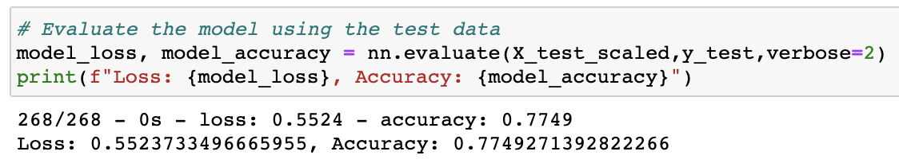

# Neural_Network_Charity_Analysis

## Overview of the Analysis

The purpose of this analysis was to create a binary classifier that is capable of predicting whether applicants will be successful if funded by Alphabet Soup. With Alphabet's dataset with over 34,000 organizations that have received funding from Alphabet Soup over the years, a neural network model was compiled, trained, and evaluated. The goal is to reach at least 75% accuracy. 

## Results
1. __Data Processing__
    1. __What variable(s) are considered the target(s) for your model?__ - In order to predict which applicants the IS SUCCESSFUL variable is our target
    1. __What variable(s) are considered to be the features for your model?__ - All columns except the IS SUCCESSFUL 
    1. __What variable(s) are neither targets nor features, and should be removed from the input data?__ -  'EIN' and 'NAME' columns
    
1. __Compiling, Training, and Evaluating the Model__
    1. __How many neurons, layers, and activation functions did you select for your neural network model, and why?__ - 43 nuerons, 2 layers, relu, no particular reason just trial and error. 
    1. __Were you able to achieve the target model performance?__ - Yes! only after keeping the NAME column
    1. __What steps did you take to try and increase model performance?__ - I first kept the EIN column and still dropped the NAME column but performance dropped so I tried keeping the NAME column and dropping the EIN column. Achievied efficiency of 77.5%
    

## Summary 
The required accuracy was achived using a deep neural network. However it may be better to utlize Random Forest Classifier as it has the ability to rank different features. 